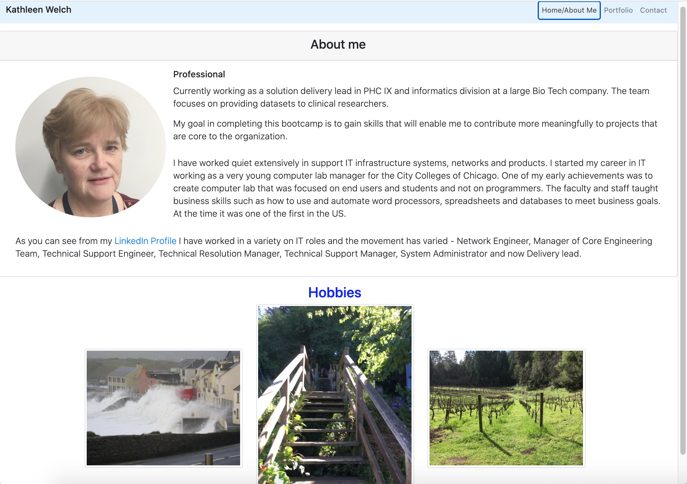
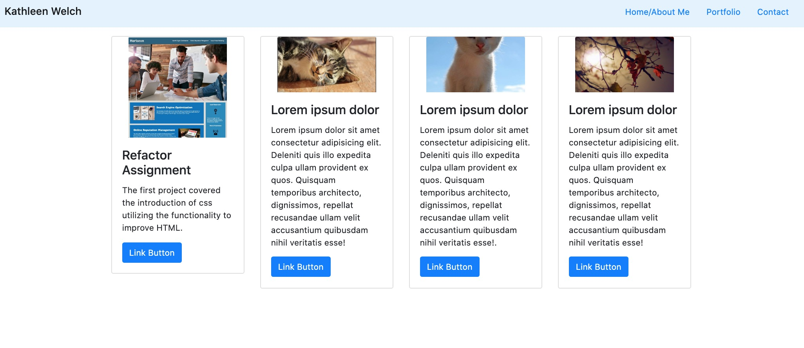

# Introduction
The assignment for homework2 is to create a web application tha utilizes the bootstrap 4 stylesheets to create responsive design ensures that web applications render well on a variety of devices and window or screen sizes.

## Table of contents
* [General info](#general-info)
* [Technologies](#technologies)
* [Setup](#setup)
* [User Guide](#user-guide)
* [Credits](#credits)

## General info
This project is simple site that illustrates some of the functions available on bootstrap 4. 
In this exercise we were requested to create the following pages Home/About Me, Portfolio & Contact page. 

	
## Technologies
Project is created with:
* Bootstrap version: 4.4.1
* Node JS version: v12.18.4
	
## Setup
To run this project, install is a simple download and extraction

## User Guide
The site is comprised of three pages - the first is my profile using overlay to show the text of hobbies.

The porfolio page is utilizing cards 

The contact page is utilizes a form has a template to allow users
to add their contact information

## credits
Much of the code used in this project was copied from the bootstrap 4 samples and W3C 
sample documents. Adjustments were made to make the code work.

Peer review by study group: Bonnie, Lucah, Jacky, Edgar, Franco

